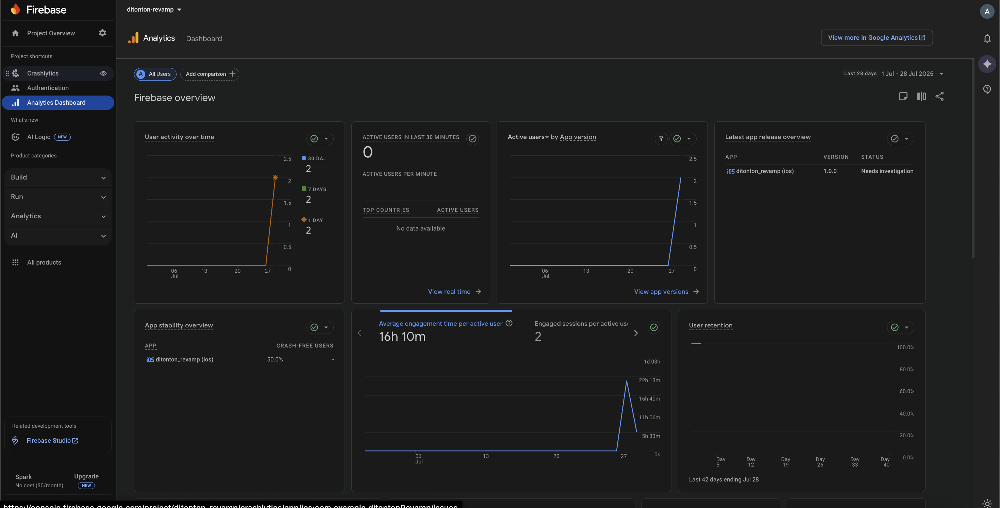

# 📱 Ditonton Revamp

Aplikasi Ditonton adalah aplikasi untuk submission akhir Menjadi Flutter Developer Expert

---

## 🚀 Fitur Utama

- Menampilkan daftar film populer, top rated, dan sedang tayang
- Pencarian film dan TV series
- Detail film dan TV series
- Menambahkan film ke watchlist
- Continuous Integration dengan Codemagic
- Integrasi dengan Firebase Analytics dan Crashlytics

---

## 🛠️ Teknologi yang Digunakan

- Flutter
- Dart
- BLoC
- Clean Architecture
- TMDb API
- SQLite
- Firebase (Analytics & Crashlytics)
- CI/CD: Codemagic

---

## ✅ Status Build

---

## 🔁 Continuous Integration (CI)

- CI dijalankan otomatis setiap kali ada push ke branch utama (`main`/`master`)
- Pengujian otomatis dijalankan (`flutter test`) untuk memastikan semua fitur tetap berjalan
- Menggunakan [Codemagic](https://codemagic.io/) sebagai layanan CI

---

## 📸 Screenshot Hasil Build Codemagic

---

## 📊 Screenshot Firebase Analytics & Crashlytics

### Firebase Analytics

Menunjukkan event seperti `select_content`, `screen_view`, dan lainnya berhasil tercatat:

### Firebase Crashlytics

Menunjukkan tidak ada crash atau error aktif, dan Crashlytics berhasil terhubung:

